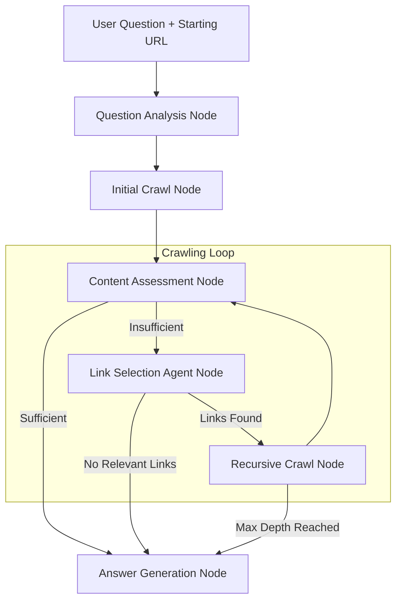

# 🤖 Intelligent Website Chatbot

<p align="center">
  <a href="https://github.com/The-Pocket/PocketFlow" target="_blank">
    
  </a>
</p>

An intelligent chatbot that dynamically crawls websites to answer questions. Built with [PocketFlow](https://github.com/The-Pocket/PocketFlow), this system starts from a given URL and intelligently follows relevant links until it finds sufficient information to answer user queries.

## 🌟 Features

- **Intelligent Web Crawling**: Dynamically explores websites by following relevant links
- **Question Analysis**: Uses LLM to understand question requirements and extract key concepts
- **Content Assessment**: Evaluates whether crawled content is sufficient to answer questions
- **Link Selection Agent**: Intelligently prioritizes which links to follow based on relevance
- **Semantic Similarity**: Uses embeddings to match content relevance to questions
- **Depth Control**: Prevents infinite crawling with configurable depth limits
- **Real-time Processing**: Provides live updates during the crawling process

## 🏗️ Architecture

The system implements three key design patterns:

1. **Agent Pattern**: Intelligent decision-making for link selection
2. **RAG Pattern**: Retrieval-Augmented Generation for content processing  
3. **Workflow Pattern**: Sequential processing with decision points

### Flow Diagram



## 📦 Installation

### Prerequisites

- Python 3.9 or higher
- OpenAI API key

### Setup

1. **Clone the repository**:
   ```bash
   git clone <repository-url>
   cd chatbot
   ```

2. **Create a virtual environment**:
   ```bash
   python3 -m venv myenv
   source myenv/bin/activate  # On Windows: myenv\Scripts\activate
   ```

3. **Install dependencies**:
   ```bash
   pip install -r requirements.txt
   ```

4. **Configure environment variables**:
   
   Copy the example environment file:
   ```bash
   cp .env.example .env
   ```
   
   Edit the `.env` file and add your OpenAI API key:
   ```bash
   nano .env  # or use your preferred editor
   ```
   
   Update the `.env` file with your actual values:
   ```
   OPENAI_API_KEY=your-actual-openai-api-key-here
   OPENAI_MODEL=gpt-4o
   MAX_CRAWL_DEPTH=3
   # ... other configuration options
   ```

## 🚀 Usage

### Basic Usage

Run the chatbot interactively:

```bash
python main.py
```

The system will prompt you for:
- **Starting URL**: The website to begin crawling (e.g., `https://example.com`)
- **Question**: Your question about the website content

### Demo Mode

Test the system with a predefined example:

```bash
python main.py --demo
```

### Example Session

```
🤖 Intelligent Website Chatbot
==================================================
This chatbot can intelligently crawl websites to answer your questions.
It will start from a given URL and follow relevant links to find information.

📝 Please provide the following information:
Starting URL (e.g., https://example.com): https://docs.python.org
Your question: How do I install Python packages?

🚀 Starting intelligent crawl and analysis...
📍 Starting URL: https://docs.python.org
❓ Question: How do I install Python packages?

🔄 Processing...

==================================================
📊 CRAWLING SUMMARY
==================================================
📄 Pages crawled: 4
🔍 Max depth reached: 2

📋 Crawled URLs:
  1. https://docs.python.org
     └─ Relevance: 0.234, Depth: 0
  2. https://docs.python.org/3/installing/
     └─ Relevance: 0.876, Depth: 1
  3. https://docs.python.org/3/tutorial/
     └─ Relevance: 0.445, Depth: 1

==================================================
🎯 FINAL ANSWER
==================================================
To install Python packages, you can use pip, which is the standard package installer...

==================================================
✅ Analysis complete!
```

## ⚙️ Configuration

The chatbot uses a centralized configuration system through `config.py` and `.env` files.

### Configuration Options

All configuration is managed through environment variables in your `.env` file:

```bash
# OpenAI Configuration
OPENAI_API_KEY=your-openai-api-key-here
OPENAI_MODEL=gpt-4o                           # LLM model to use
OPENAI_EMBEDDING_MODEL=text-embedding-3-small # Embedding model

# Crawling Configuration
MAX_CRAWL_DEPTH=3          # Maximum depth to crawl
MAX_CONTENT_LENGTH=10000   # Max characters per page
MAX_LINKS_PER_PAGE=10      # Max links to extract per page
MAX_LINKS_TO_CRAWL=3       # Max links to follow per iteration

# Request Configuration
REQUEST_TIMEOUT=10         # HTTP request timeout in seconds
USER_AGENT=Mozilla/5.0...  # User agent for web requests

# Content Processing Configuration
MIN_RELEVANCE_SCORE=0.1    # Minimum relevance score for content
EMBEDDING_MAX_CHARS=8000   # Max characters for embedding
CONTENT_PREVIEW_CHARS=2000 # Characters for content preview

# Debug Configuration
DEBUG=false                # Enable debug mode
VERBOSE_LOGGING=false      # Enable verbose logging
```

### Viewing Current Configuration

You can check your current configuration by running:

```python
from config import Config
print(Config.get_summary())
```

## 🔧 Components

### Utility Functions

- **`web_scraper.py`**: Scrapes web pages and extracts structured content
- **`content_extractor.py`**: Cleans and structures HTML content
- **`link_analyzer.py`**: Analyzes and prioritizes links based on relevance
- **`content_embedder.py`**: Generates embeddings for semantic similarity
- **`similarity_calculator.py`**: Calculates cosine similarity between embeddings
- **`call_llm.py`**: Interfaces with OpenAI's GPT models

### Node Classes

- **`QuestionAnalysisNode`**: Analyzes user questions and generates embeddings
- **`InitialCrawlNode`**: Crawls the starting webpage
- **`ContentAssessmentNode`**: Evaluates content sufficiency
- **`LinkSelectionAgentNode`**: Intelligently selects relevant links
- **`RecursiveCrawlNode`**: Crawls selected links in parallel
- **`AnswerGenerationNode`**: Synthesizes final answers from collected content

## 🛠️ Development

### Project Structure

```
chatbot/
├── docs/
│   └── design.md          # Detailed design document
├── utils/                 # Utility functions
│   ├── call_llm.py
│   ├── web_scraper.py
│   ├── content_extractor.py
│   ├── link_analyzer.py
│   ├── content_embedder.py
│   └── similarity_calculator.py
├── nodes.py               # Node implementations
├── flow.py                # Flow definition
├── main.py                # Main application
├── config.py              # Configuration management
├── .env                   # Environment variables (create from .env.example)
├── .env.example           # Example environment variables
└── requirements.txt       # Dependencies
```

### Testing Individual Components

Test utility functions:
```bash
python utils/web_scraper.py
python utils/link_analyzer.py
```

### Adding New Features

1. **Modify the design document** in `docs/design.md`
2. **Update utility functions** if needed
3. **Modify node classes** in `nodes.py`
4. **Update the flow** in `flow.py`
5. **Test the changes**

## 📝 Design Document

For detailed technical specifications, see [docs/design.md](docs/design.md).

## 🤝 Contributing

This project follows the [Agentic Coding](https://the-pocket.github.io/PocketFlow/guide.html) methodology:

1. **Requirements**: Understand the problem from user perspective
2. **Flow Design**: Design high-level workflow with patterns
3. **Utilities**: Implement external interface functions
4. **Data Schema**: Design shared store structure
5. **Nodes**: Implement processing nodes
6. **Implementation**: Connect everything together

## 📄 License

This project is built with [PocketFlow](https://github.com/The-Pocket/PocketFlow).

## 🔗 Resources

- [PocketFlow Documentation](https://the-pocket.github.io/PocketFlow/)
- [Agentic Coding Guide](https://the-pocket.github.io/PocketFlow/guide.html)
- [YouTube Tutorial](https://www.youtube.com/@ZacharyLLM?sub_confirmation=1)
