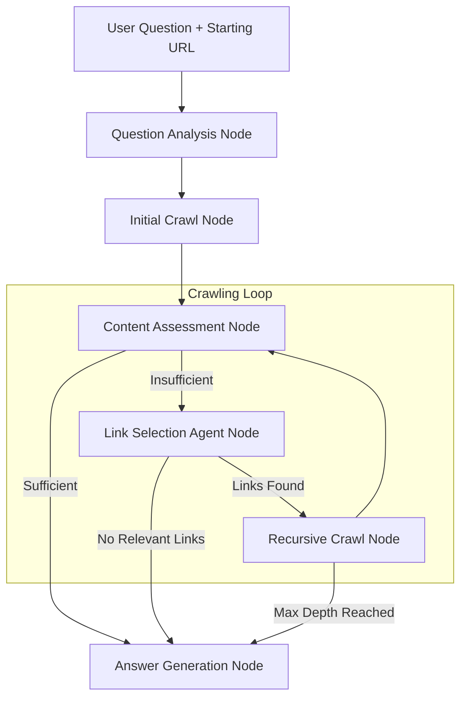

# Design Doc: Intelligent Website Chatbot

> Please DON'T remove notes for AI

## Requirements

> Notes for AI: Keep it simple and clear.
> If the requirements are abstract, write concrete user stories

### Problem Statement
Users need a chatbot that can intelligently explore and understand website content to answer questions. Unlike traditional chatbots that work with pre-indexed content, this system should dynamically crawl websites starting from a given URL and follow relevant links until it finds sufficient information to answer user queries.

### User Stories
1. **As a user**, I want to ask questions about a website's content without manually browsing through multiple pages
2. **As a user**, I want the chatbot to automatically discover relevant information by following links when the initial page doesn't contain enough context
3. **As a user**, I want accurate answers based on the most current website content, not stale cached data
4. **As a user**, I want the system to be efficient and not crawl unnecessary pages

### Success Criteria
- Chatbot successfully answers questions using content from multiple linked pages
- System intelligently decides which links are relevant to follow
- Crawling stops when sufficient information is found or maximum depth is reached
- Response time remains reasonable (under 30 seconds for complex queries)

## Flow Design

> Notes for AI:
> 1. Consider the design patterns of agent, map-reduce, rag, and workflow. Apply them if they fit.
> 2. Present a concise, high-level description of the workflow.

### Applicable Design Patterns:

1. **Agent Pattern**: Intelligent decision-making agent that decides which links to follow based on question context
   - *Context*: User question, current page content, available links
   - *Actions*: Crawl current page, follow specific links, generate answer, or request more information

2. **RAG Pattern**: Retrieval-Augmented Generation for finding and using relevant content
   - *Retrieval*: Extract and index content from crawled pages
   - *Generation*: Use retrieved content to generate contextual answers

3. **Workflow Pattern**: Sequential processing with decision points for crawling strategy

### Flow High-level Design:

1. **Question Analysis Node**: Analyze user question to understand information requirements
2. **Initial Crawl Node**: Crawl the starting webpage and extract content
3. **Content Assessment Node**: Determine if current content is sufficient to answer the question
4. **Link Selection Agent Node**: Intelligently select which links to follow based on relevance
5. **Recursive Crawl Node**: Continue crawling selected links with depth control
6. **Answer Generation Node**: Synthesize final answer from all collected content



## Utility Functions

> Notes for AI:
> 1. Understand the utility function definition thoroughly by reviewing the doc.
> 2. Include only the necessary utility functions, based on nodes in the flow.

1. **Call LLM** (`utils/call_llm.py`)
   - *Input*: prompt (str)
   - *Output*: response (str)
   - Used by question analysis, content assessment, link selection, and answer generation nodes

2. **Web Scraper** (`utils/web_scraper.py`)
   - *Input*: url (str), max_content_length (int)
   - *Output*: dict with {url, title, content, links, metadata}
   - Used by initial crawl and recursive crawl nodes to extract webpage content

3. **Content Extractor** (`utils/content_extractor.py`)
   - *Input*: raw_html (str)
   - *Output*: dict with {clean_text, title, links, images}
   - Used to clean and structure scraped content

4. **Link Analyzer** (`utils/link_analyzer.py`)
   - *Input*: links (list), base_url (str), question_context (str)
   - *Output*: list of prioritized relevant links
   - Used by link selection agent to filter and rank links

5. **Content Embedder** (`utils/content_embedder.py`)
   - *Input*: text (str)
   - *Output*: vector of 1536 floats (OpenAI embedding)
   - Used for semantic similarity between question and content

6. **Similarity Calculator** (`utils/similarity_calculator.py`)
   - *Input*: question_embedding (list), content_embedding (list)
   - *Output*: similarity_score (float)
   - Used to assess content relevance

## Node Design

### Shared Store

> Notes for AI: Try to minimize data redundancy

The shared store structure is organized as follows:

```python
shared = {
    "user_question": "What is the company's return policy?",
    "starting_url": "https://example.com",
    "question_embedding": [0.1, 0.2, ...],  # Question vector for similarity
    "crawled_pages": {
        "https://example.com": {
            "content": "...",
            "title": "...",
            "links": [...],
            "relevance_score": 0.8,
            "crawl_depth": 0
        }
    },
    "crawl_queue": ["https://example.com/returns", "https://example.com/faq"],
    "max_crawl_depth": 3,
    "current_depth": 1,
    "sufficient_content": False,
    "final_answer": ""
}
```

### Node Steps

> Notes for AI: Carefully decide whether to use Batch/Async Node/Flow.

1. **Question Analysis Node**
   - *Purpose*: Analyze user question to extract key information requirements and create embeddings
   - *Type*: Regular Node
   - *Steps*:
     - *prep*: Read "user_question" from shared store
     - *exec*: Call LLM to identify question type and key concepts, generate question embedding
     - *post*: Write "question_embedding" and "question_analysis" to shared store

2. **Initial Crawl Node**
   - *Purpose*: Crawl the starting webpage and extract structured content
   - *Type*: Regular Node
   - *Steps*:
     - *prep*: Read "starting_url" from shared store
     - *exec*: Use web_scraper utility to fetch and parse initial page
     - *post*: Write initial page data to "crawled_pages" and populate "crawl_queue" with found links

3. **Content Assessment Node**
   - *Purpose*: Determine if current crawled content contains sufficient information to answer the question
   - *Type*: Regular Node
   - *Steps*:
     - *prep*: Read "crawled_pages", "question_embedding", and "user_question" from shared store
     - *exec*: Calculate content relevance scores, call LLM to assess sufficiency
     - *post*: Write "sufficient_content" boolean and update relevance scores in "crawled_pages"

4. **Link Selection Agent Node**
   - *Purpose*: Intelligently select which links to follow next based on question context and link relevance
   - *Type*: Regular Node
   - *Steps*:
     - *prep*: Read "crawl_queue", "question_analysis", "current_depth", "max_crawl_depth" from shared store
     - *exec*: Use link_analyzer utility and LLM to rank and filter links by relevance
     - *post*: Update "crawl_queue" with prioritized relevant links

5. **Recursive Crawl Node**
   - *Purpose*: Crawl selected links and add their content to the knowledge base
   - *Type*: Batch Node (to crawl multiple links in parallel)
   - *Steps*:
     - *prep*: Read top links from "crawl_queue" and "current_depth" from shared store
     - *exec*: Use web_scraper utility to fetch content from selected links
     - *post*: Add new page data to "crawled_pages", increment "current_depth", update "crawl_queue"

6. **Answer Generation Node**
   - *Purpose*: Synthesize final answer using all collected relevant content
   - *Type*: Regular Node
   - *Steps*:
     - *prep*: Read "crawled_pages", "user_question", and relevance scores from shared store
     - *exec*: Call LLM with question and all relevant content to generate comprehensive answer
     - *post*: Write "final_answer" to shared store

